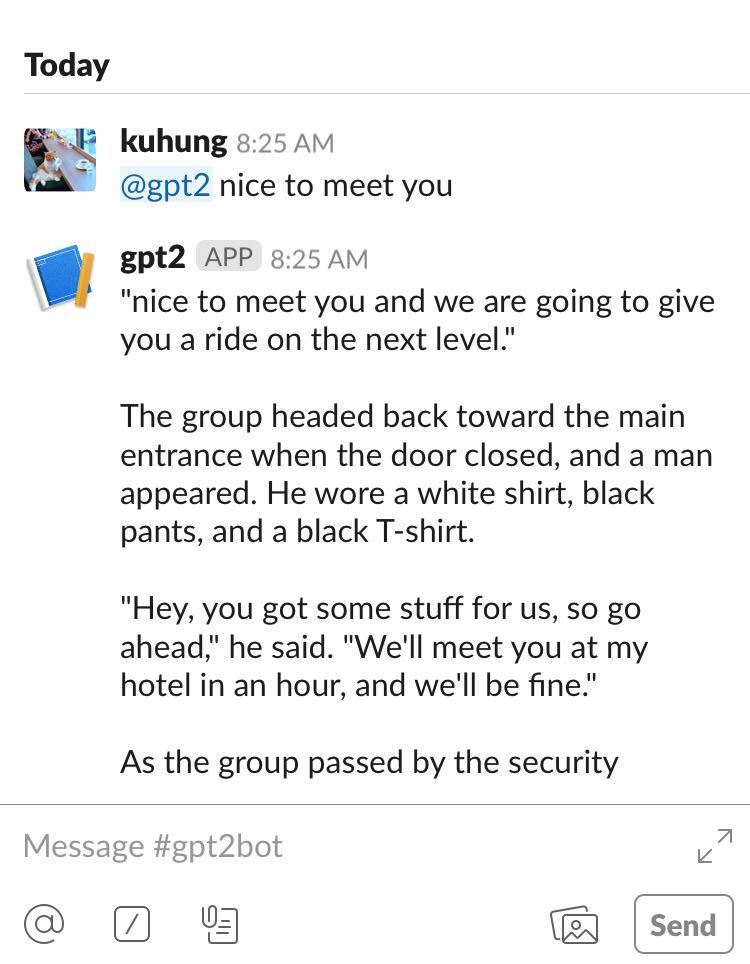

# Slack GPT2
Just @ this bot and type in a message to get an output from GPT2 conditioned on the message.


# Installation
First setup your slack integration and obtain the bot oauth token. Then paste the bot token
into `starterbot.py`.

```
conda create -n slackbot python=3.6
source activate slackbot
pip install -r requirements.txt
cd gpt2
pip install -r requirements.txt
python download_model.py 117M
cd ..
python starterbot.py
```
# Thanks to these libraries for making it easy.
# slack-starterbot
A simple Python-powered starter Slack bot. Read
[the tutorial](https://www.fullstackpython.com/blog/build-first-slack-bot-python.html)
for a full overview.

# gpt-2
[Code](https://github.com/openai/gpt-2) for the paper "Language Models are Unsupervised Multitask Learners"
